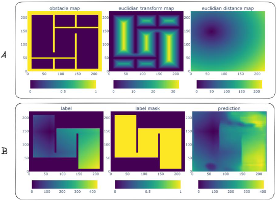

This repo contains my submissions for the Intelligent Systems (2802ICT) course at Griffith University.

The course more or less had 4 domains:

| Domain | Algorithms | Key Implementation Detail |
| :--- | :--- | :--- |
| Search | A*, BFS, DFS | Custom maze-solving heuristics |
| Logic | CSP / Backtracking | Constraint satisfaction for Crosswords |
| ML | ID3 Decision Tree | Recursive information gain calculation |
| Deep Learning | MLP / Backpropagation | Manual gradient descent in NumPy |

In completing the course the Search/Logic domains were assessed in assignment 1 and the ML/Deep Learning domains were assessed in assignment 2.

The writeup for the first assignment can be found [here](./2802ict-assignments/assignment_01/Report.pdf). In completing the first assignment I thought it'd be fun to extend the A* algorithm with a heuristic map generated by a small convolutional neural network written in JAX. In doing so I took heavy inspiration from [this paper](https://arxiv.org/pdf/1908.03343).

The model accepts a 224x224x3 tensor where channel one is a binary obstacle map (0 for empty space, 1 for walls), channel two is a Euclidian transform of the obstacle map and, channel three is a euclidian distance map from the goal point (FA). No input normalisation was performed. The output is then a 224x224x1 tensor representing the heuristic 
value of each cell (B).

The writeup for the second assignment can be found [here](./2802ict-assignments/assignment_02/Report.pdf). I'm mainly proud of the process I undertook to determine the correct numpy operations as part of the backpropagation algorithm, of which my working can be found [here](./2802ict-assignments/assignment_02/nn/notebooks%20(pdf)/planning.pdf).